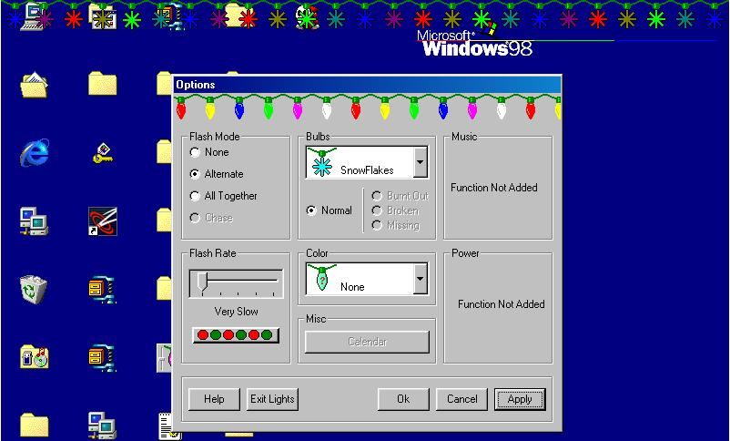



## Lights 2001 \(Updated\)

### Description

This will put Holiday Lights on your Desktop. This is a little program I have been working on for a little while.

 

 

Please leave a comment on how I could better it.

any comments would be welcome.

 

 

Thanks...
 
### More Info
 
This will put animated christmas lights on your desktop.

more options to come

 

 

Hey I wouold also like some help with this if any one knows how to minimize the size of the code and still have it do the same stuff please let me know!!!

Thanks

             |
---                |---
**Submitted On**   |2001-02-22 23:34:12
**By**             |[Arcangel\_99](https://github.com/Planet-Source-Code/PSCIndex/blob/master/ByAuthor/arcangel-99.md)
**Level**          |Intermediate
**User Rating**    |5.0 (15 globes from 3 users)
**Compatibility**  |VB 5\.0, VB 6\.0
**Category**       |[Graphics](https://github.com/Planet-Source-Code/PSCIndex/blob/master/ByCategory/graphics__1-46.md)
**World**          |[Visual Basic](https://github.com/Planet-Source-Code/PSCIndex/blob/master/ByWorld/visual-basic.md)
**Archive File**   |[CODE\_UPLOAD153582232001\.zip](https://github.com/Planet-Source-Code/arcangel-99-lights-2001-updated__1-21227/archive/master.zip)

